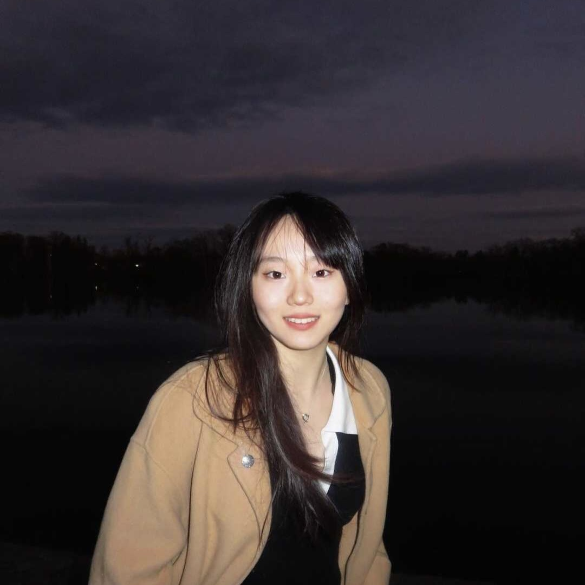
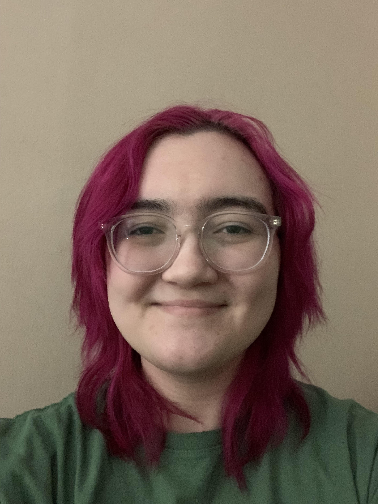

Hi, I'm Shiya Cao, an Assistant Professor of Statistical and Data Sciences at Smith College. I created the Disability Inclusion Analytics Lab (DIAL) in Fall 2022, to advance my research in disability inclusion and broader social inclusion topics using quantitative, qualitative, and design science methods. My lab engages Smith College undergraduates in these research topics and helps them pay attention to human, social, and emotional elements of statistics and data science. If you're interested in a research collaboration or joining my lab, please [email me](mailto:scao53@smith.edu).

I've published multiple papers in high-ranking peer-reviewed journals and conferences including *Work: A Journal of Prevention, Assessment & Rehabilitation*, *Behavior & Information Technology*, and *the Hawaii International Conference on System Sciences* as well as a book chapter titled *The Chains that Bind: Gender, Disability, Race, and IT Accommodations*.

## Meet the Team

### Shiya Cao

My name is Shiya Cao, the founder of the DIAl Lab. I've been working on disability inclusion research since Fall 2016 when I was a graduate student at Worcester Polytechnic Institute. I've studied accommodation management systems for disabled employees in the workplace, accessibility issues, applied statistics in disability inclusion using population surveys, the intersection of identity attributes, and the integration of disability inclusion components into statistics and data science pedagogy. I am enthusiastic about the disability inclusion field and am hoping to promote this research and disability awareness in the statsitics and data science community.

### Christy Yang

Hello, my name is Christy Yang. I’m a junior double majoring in SDS and Math. I am eager to use data and technology to drive real-world impact and to create a more inclusive society for disabled people in this lab. I along with Vicky Xu (co-authored with Prof. Cao) presented the initial results of the project "Examining Environmental Barriers for Disabled Employees in Different Industries and Work Spaces" at the *2023 Women in Statistics and Data Science Conference*.

### Elm Markert

Hello, my name is Elm Markert and I am a junior Statistical and Data Sciences Major with a Biological Sciences Minor. I'm excited to engage in the human and social aspects of data analytics, and am eager to utilize my quantitative analysis skills to advance disability awareness and inclusion. I joined the DIAL lab in Fall 2023 and worked with Christy Yang and Prof. Cao to write a journal paper for the project "Examining Environmental Barriers for Disabled Employees in Different Industries and Work Spaces".

### Sarah Susnea

Hello, my name is Sarah Susnea. I am a junior majoring in Statistical and Data Sciences and minoring in Sociology. I joined the DIAL lab in Spring 2024. I am excited to apply the quantitative and qualitative analysis skills I’ve learned throughout my studies to research disability inclusion at Smith. I am passionate about data science and statistics’ potential to contribute positively to our society, and I hope to assist the lab with achieving this goal as well as advancing awareness on the topics of disability inclusion.

### Yujie Gong

Hello, my name is Yujie Gong. I am a junior double majoring in Statistical & Data Science and Psychology. I am passionate about utilizing my data analysis skills to foster a more inclusive environment and improve the quality of life for individuals with disabilities. I am particularly interested in exploring ways to raise awareness and understanding of disability within our society. I hope that throughout this lab experience, I could gain more skills working with data and develop a deeper understanding towards disability inclusion.

### Sophia Silovsky

Hello, my name is Sophia Silovsky. I am a senior with a Statistical and Data Sciences major and a Sociology minor. I am interested in investigating social justice issues, in particular disability, with statistical and data analytical methods. I am eager to utilize my current skills and learn more about this intersection of quantitative analysis and disability-based data. I joined the DIAL lab in Spring 2024, and I am excited to further research in disability inclusion.

### Lab Alumni

Linh Pham (Fall 2022 - Spring 2023)

Zhirou Liu (Spring 2023)

Vicky Xu (Spring 2023 & SURF 2023)

Amber Liu (SURF 2023)

Nikki Lin (SURF 2023)
