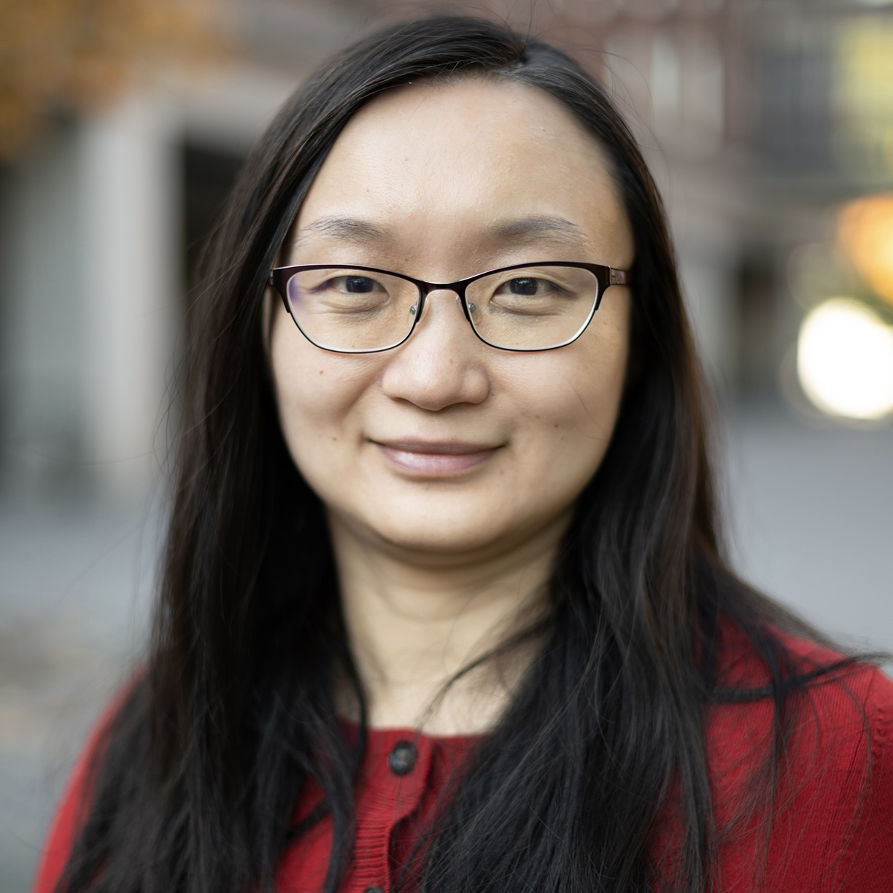
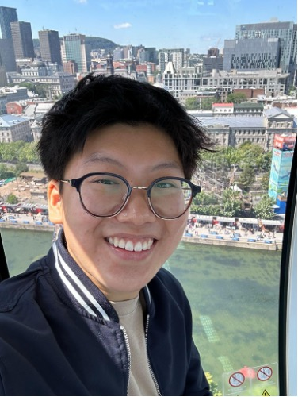
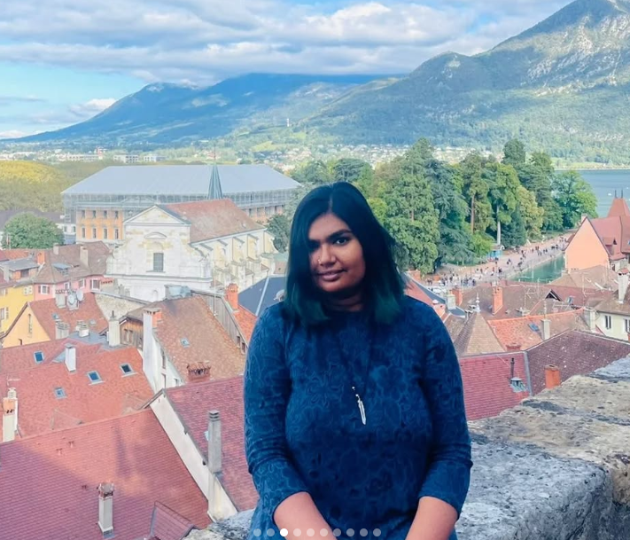

Hi, I'm Shiya Cao, an Assistant Professor of Statistical and Data Sciences at Smith College. I created the Disability Inclusion Analytics Lab (DIAL) in Fall 2022, to advance my research in disability inclusion and broader social inclusion topics using quantitative and qualitative methods. My lab engages Smith College undergraduates in these research topics and helps them pay attention to human, social, and emotional elements of data science. If you're interested in a research collaboration or joining my lab, please [email me](mailto:scao53@smith.edu).

I've published multiple papers in high-ranking peer-reviewed journals and conferences including *Work: A Journal of Prevention, Assessment & Rehabilitation*, *Behavior & Information Technology*, and *the Hawaii International Conference on System Sciences* as well as a book chapter titled *The Chains that Bind: Gender, Disability, Race, and IT Accommodations*.

## Meet the Team

### Shiya Cao

My name is Shiya Cao, the founder of the DIAl Lab. I've been working on disability inclusion research since Fall 2016 when I was a graduate student at Worcester Polytechnic Institute. I've studied accommodation management systems for disabled employees in the workplace, accessibility issues, applied statistics in disability inclusion using population surveys, the intersection of identity attributes, and the integration of disability inclusion components into data science pedagogy. I am enthusiastic about the disability inclusion field and am hoping to promote this research and disability awareness in the data science community.

### Lucia Qin

Hi! I’m Lucia, a junior double majoring in Statistical and Data Sciences and Quantitative Economics. I’m passionate about data analytics and love diving into both qualitative and quantitative research using what I’ve learned in my classes. I’m excited to join the DIAL Lab this fall and can’t wait to learn more about different research methods, practice my data skills, and see how insights can drive real changes, especially in the disability inclusion field. 

### Kayla Tillmon

Hello! My name is Kayla. I’m a sophomore majoring in Statistical Data Sciences. I love data analysis more than anything and I’m excited to use what I learned in class and apply it to this lab. I joined this lab in Fall of 2024. Disability inclusion has always been a passion of mine so I’m looking forward to learn more and do what I can to make this campus more accessible.

### Rae Traver-Fallick

Hi, my name is Rae Traver-Fallick (they/them), and I’m a sophomore student and Posse scholar majoring in mathematics. I am passionate about leveraging mathematics and data science to drive social good, so I am thrilled to be joining the DIAL lab this fall. I can’t wait to apply the programming skills I’ve learned in the classroom to the issue of disability inclusion and dive into undergraduate research. In addition, outside of DIAL, I work to foster diversity and inclusion in STEM as a student leader of the AEMES (Achieving Excellence in Mathematics, Engineering, and Science) Peer Mentoring Program.

### Mehreen Mirza

Hello! My name is Mehreen and I am a senior majoring in Economics and Statistical Data Sciences at Smith. I initially started this project in Fall 2023 as my seminar project for the SDS 300di disability inclusion seminar class. I care deeply about disability justice, intersectionality and improving accessibility. I am an advocate of universal design and hope to incorporate it in the way I present my research. I am excited to join the lab this Spring to further explore the intersectionality and disparities within the community of people with chronic illnesses.

### Lab Alumni

Linh Pham (Fall 2022 - Spring 2023)

Zhirou Liu (Spring 2023)

Vicky Xu (Spring 2023 & SURF 2023)

Amber Liu (SURF 2023)

Nikki Lin (SURF 2023)

Christy Yang (Spring 2023 - Spring 2024 & SURF 2023)

Elm Markert (Fall 2023 - Spring 2024)

Yujie Gong (Spring 2024)

Sophia Silovsky (Spring 2024)

Sarah Susnea (Spring 2024 & Fall 2024)
