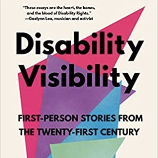
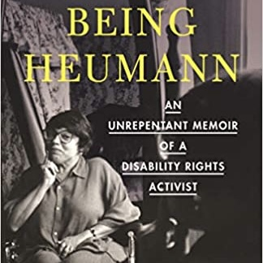

## Identity-First Language vs. Person-First Language

We recognize that there is still a debate in the disability community regarding [identity-first versus person-first language](https://jtds.commons.gc.cuny.edu/person-first-language-vs-identity-first-language-an-examination-of-the-gains-and-drawbacks-of-disability-language-in-society/) (Ferrigon & Tucker, 2019). There are valid arguments on both sides. In this lab, we use identity first language, which is more in line with the critical lens and social model we apply, and will continue to learn from research and seek more guidance from self-advocates to inform our work and the language we use. We hope you will receive our work as it is intended, to advocate, support, and empower the disability community.

## Basic Principles of Disability Etiquette

> This section draws from [Disability Etiquette](https://www.easterseals.com/support-and-education/facts-about-disability/disability-etiquette.html) and [Invisible Disability and Etiquette](https://www.disabled-world.com/disability/types/invisible/manners.php#:~:text=If%20you%20are%20aware%20that,a%20form%20of%20invisible%20disability). 

* If you would like to help a disabled person, ask if they need it, and listen to any instructions the person may want to give.
* Be considerate of the extra time it might take a disabled person to get things done or said. Let the person set the pace in walking and talking.
* Treat adults accordingly.
* Call a person by their first name only when you extend this familiarity to everyone present.
* Don’t be embarrassed if you happen to use common expressions that seem to relate to the person’s disability such as “See you later” or “I’ve got to run.”
* When planning events involving disabled people, consider their needs ahead of time. If there’s a potential barrier, like a flight of stairs, narrow doors, an inaccessible restroom, or noise exposure, reach out and discuss the situation with them in advance.
* If you have a question about access, always ask it and don’t assume you already know the answer.

### When you're with a wheelchair user:

* **Don’t** lean or hang on someone’s wheelchair.
* **Do** remember that wheelchairs are an extension of personal space.
* Ask permission before touching someone’s wheelchair.
* **Don’t** patronize people who use wheelchairs by patting them on the head.
* **Do** place yourself at the wheelchair user’s eye level to spare both of you a stiff neck if you’re talking for more than a few minutes.
* **Do** consider distance, weather conditions, and physical obstacles such as stairs, curbs, and steep hills when giving directions.

### When you're with people who are blind or have low vision:

* **Don’t** grab a person’s arm in order to guide them.
* **Do** allow the person to take your arm. This will help you to guide, rather than propel or lead, the person.
* **Do** use specifics such as “left a hundred feet” or “right two yards.”
* **Don't** leave them without excusing yourself first.
* If the person has a guide dog, **don't** distract the dog; it is always working and is not a pet.

### When you're with people who are deaf or hard-of-hearing:

* **Don’t** shout.
* **Do** look directly at the person and speak clearly and expressively to establish if the person can read your lips. Remember, not everyone who is deaf or hard-of-hearing can lip-read. Those who do will rely on facial expressions and other body language to help understand. 
* Talk directly to the person, even if the person has a sign language interpreter with them.
* Show consideration by facing a light source and keeping your hands and food away from your mouth when speaking.

### Invisible disabilities:

* When you plan an event, make sure that accessibility needs are directed to a real person; it provides the opportunity for people who have invisible disabilities to reach out and not feel as if they are imposing.
* If you are aware that a person has a form of invisible disability, the best tactic may be to simply speak with the person and ask them what they are able to do and what they cannot do. 
* In a group of people, always assume there is someone who experiences a form of invisible disability. Assume there is a person in any group of people who experiences a form of hearing loss. When you speak to an audience, face your audience.
* If a person says they are unable to do something, do not attempt to somehow coax or convince them to try anyway. Instead, ask the person what you can do to make their participation possible and invite them to participate to the degree they are able to.
* Never judge another person's limitations or pain. Instead, accept as truth the things a person who has invisible disabilities tells you.

## Related Books & Media

### [Disability Visibility](https://www.amazon.com/Disability-Visibility-First-Person-Stories-Twenty-First/dp/1984899422)

"Activist Alice Wong brings together this urgent, galvanizing collection of contemporary essays by disabled people... This anthology gives a glimpse into the rich complexity of the disabled experience, highlighting the passions, talents, and everyday lives of this community. It invites readers to question their own understandings. It celebrates and documents disability culture in the now. It looks to the future and the past with hope and love."

### [Being Heumann: An Unrepentant Memoir of a Disability Rights Activist](https://www.amazon.com/Being-Heumann-Unrepentant-Disability-Activist/dp/0807019291)

"A story of fighting to belong in a world that wasn’t built for all of us and of one woman’s activism—from the streets of Brooklyn and San Francisco to inside the halls of Washington—Being Heumann recounts Judy Heumann’s lifelong battle to achieve respect, acceptance, and inclusion in society. Paralyzed from polio at eighteen months, Judy’s struggle for equality began early in life. From fighting to attend grade school after being described as a “fire hazard” to later winning a lawsuit against the New York City school system for denying her a teacher’s license because of her paralysis, Judy’s actions set a precedent that fundamentally improved rights for disabled people... Candid, intimate, and irreverent, Judy Heumann’s memoir about resistance to exclusion invites readers to imagine and make real a world in which we all belong."

### [Crip Camp](https://www.netflix.com/title/81001496)

<iframe width="560" height="315" src="https://www.youtube.com/watch?v=XRrIs22plz0&t=1s" title="YouTube video player" frameborder="0" allow="accelerometer; autoplay; clipboard-write; encrypted-media; gyroscope; picture-in-picture" allowfullscreen>
</iframe>

"Crip Camp starts in 1971 at Camp Jened, a summer camp in New York described as a 'loose, free-spirited camp designed for disabled teens'. Starring Larry Allison, Judith Heumann, James LeBrecht, Denise Sherer Jacobson, and Stephen Hofmann, the film focuses on those campers who turned themselves into activists for the disability rights movement and follows their fight for accessibility legislation."

## References

Easterseals. (2022). Disability etiquette.  https://www.easterseals.com/support-and-education/facts-about-disability/disability-etiquette.html

Ferrigon, P., & Tucker, K. (2019). Person-first language vs. identity-first language: An examination of the gains and drawbacks of disability language in society. *Journal of Teaching Disability Studies*, 70(3), 255-264.

