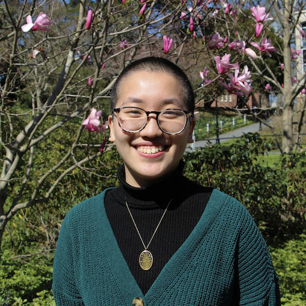
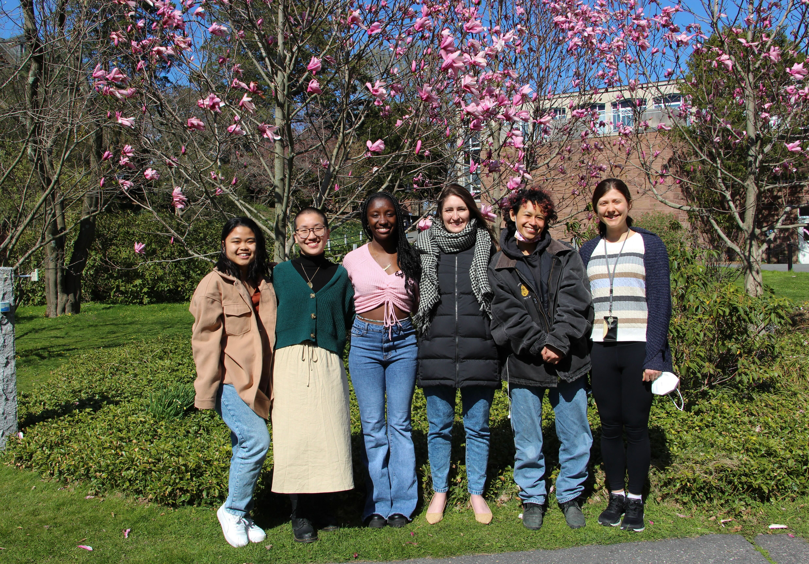

## About

The Data Ethnography and Advocacy Lab is a multi-disciplinary research group investigating the production, governance, and dissemination of public interest datasets in the United States. In addition to documenting the socio-cultural histories of open government datasets, DEAL is working to innovate new methodologies for studying the social conditions that enable, foster, or incentivize deceptive or distortive data practices. Our work is informed by and contributes to the fields of critical data studies, information studies, and science and technology studies. Further, our work helps to identify opportunities for strengthening US data collection programs, improving data documentation practices, and cultivating deeper data infrastructure literacy.

## Lab Members

### Juniper Huang

My name is Juniper Huang, and I have been a part of this research since the Fall of 2021 as a Critical Data Analyst. I am currently a second-year Statistical Data Science major at Smith College. I am passionate about metadata and the many different factors that affect a dataset. Outside of research, I am the Head of New Students for Talbot House, I am part of the Pan-Asian in Action e-board, and I am an active member of the Statistical Data Science Coalition of Color.

### Naomi Liftman

Hi, I’m Naomi Liftman. I was born in California but grew up in Boston for most of my life. I’m a Statistical Data Science (SDS) major at Smith College with a minor in Women and Gender studies and am currently heading into my senior year. Outside of school I am the captain of the Ultimate Frisbee team, and am the Vice President of my house. Overall, my passion lies with SDS, and I love working with data whether its on the production, analysis, or ethnographic side!

### Alumni

* Nicole Tresvalles (Spring '22)
* Sena Amuzu (Spring '22)
* Emarie de la Nuez (Spring '22)
* Quinn White (Spring '22)

## Blog


  


## Lab Book

See our lab protocols [here](/lab-book/).

